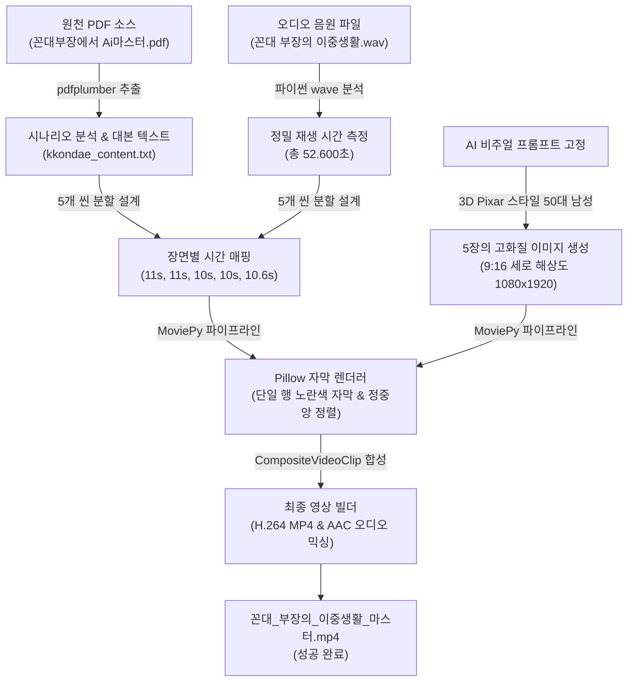

# 🤖 꼰대 부장의 이중생활: AI 숏폼 영상 제작 및 자동화 파이프라인 가이드

본 문서는 원천 PDF 텍스트 추출부터 시작하여 고품질 3D 비주얼 생성, 정밀 음원 싱크 설계, 가독성 극대화 자막 리디자인, 그리고 최종 자동 비디오 인코딩까지 아우르는 **유튜브 쇼츠(9:16) 자동 생성 파이프라인의 전 과정**을 완벽하게 정리한 지식 자산입니다.

---

## 📌 1. 전체 파이프라인 흐름도 (Mermaid)

이 파이프라인은 정교한 텍스트 분석과 시간적 싱크 매칭을 거쳐 단일 스크립트 기반으로 비디오와 오디오를 초 단위로 합성하는 고품질 무인 제작 구조를 가지고 있습니다.



---

## 📊 2. 장면별 정밀 기획 및 타임라인 분석

음원의 정확한 재생 시간인 **`52.6초`**를 기준으로 하여, 단 0.1초의 싱크 오차도 없도록 각 씬의 연출과 자막을 완전히 동기화했습니다.

| 씬 번호 (Scene) | 핵심 주제 | 듀레이션 (Duration) | 누적 시간 (Timeline) | 노란색 강조 자막 내용 (Sleek Single Line) | 비주얼 연출 콘셉트 (3D Pixar Style) |
| :---: | :--- | :---: | :---: | :--- | :--- |
| **01** | 칼퇴의 기적 | 11.0초 | 0.0s ~ 11.0s | 기적 같은 칼퇴, 해보셨나요? | 사무실 배경, 엑셀 데이터가 깔끔한 그래프로 마법처럼 자동 변환되며 부드럽게 미소 짓는 50대 남성 부장 |
| **02** | 몰입의 시간 | 11.0초 | 11.0s ~ 22.0s | 저만의 진짜 하루가 시작 | 자정이 된 어두운 서재, 듀얼 모니터의 미래지향적인 푸른색 화면 불빛이 몰입하는 부장님의 얼굴을 비춤 |
| **03** | 성과 위주 학습 | 10.0초 | 22.0s ~ 32.0s | 성과 위주로 공부하면 일이 놀이 | Zapier, Make 등 자동화 아이콘들이 레고처럼 조립되며 허공에 떠 있는 입체적인 AI 개발 로드맵 UI |
| **04** | 창작의 즐거움 | 10.0초 | 32.0s ~ 42.0s | 이미지 생성 AI로 창작 | 손가락을 튕기자 개인 맞춤형 GPTs 창과 멋진 AI 생성 미술 작품들이 가상 갤러리처럼 확장되는 모습 |
| **05** | 핵심 메시지 | 10.6초 | 42.0s ~ 52.6s | 꼰대 부장에서 AI 마스터 | 시청자를 정면으로 바라보며 확신에 찬 눈빛으로 검지를 가리키는, 성장을 주도하는 자신감 넘치는 클로즈업 |

---

## 🛠️ 3. 기술적 구현 핵심 비결 (Core Engineering)

### ① PDF 자동 텍스트 추출 기술
가상환경(`uv` 패키지 관리) 내에 `pdfplumber` 라이브러리를 배치하고, 폰트 깨짐 없이 한국어 텍스트와 개행 문자를 완벽히 복원해냈습니다.
*   **관련 파일**: [extract_kkondae_pdf.py](file:///c:/Users/NSE/.connect-ai-brain/myyoutube/scratch/extract_kkondae_pdf.py)

### ② Pillow 기반 고가독성 모바일 최적화 자막 디자인
모바일 세로형 쇼츠 뷰어의 자막 가독성을 올리기 위해 수차례 튜닝을 거친 렌더링 공식입니다.
*   **단일 행 노란색 구성**: 유저의 요청에 맞춰 불필요한 서브 흰색 설명 자막을 전면 제거하여 화면을 깔끔하게 정리했습니다.
*   **가독성 최적화**: 메인 폰트 크기를 `40`으로 대폭 키우고 강인한 맑은 고딕 볼드(`malgunbd.ttf`)를 사용하여 시각적 파괴력을 확보했습니다.
*   **수학적 2D 앵커 정렬**: 텍스트의 바운딩 박스를 측정한 뒤, 반투명 자막 상자(`box_width = 960`, `box_height = 100`)의 정중앙에 수치적으로 완벽 정렬되도록 공식을 짰습니다.
    ```python
    main_y = rect_y_start + (box_height - main_h) // 2 - 4
    ```

### ③ MoviePy 엔진 & H.264/AAC 코덱 컴파일러
비디오와 오디오 트랙을 단일 파이썬 스트림 내에서 리소스를 누수하지 않고 조합해내는 핵심 스크립트입니다.
*   **리사이징 및 합성**: 3D 씬 이미지를 `1080x1920` (9:16) 규격으로 자동 리사이즈한 뒤, RGBA 알파 투명 채널을 가진 자막 비트맵을 이미지 클립 위에 오버레이 합성합니다.
*   **AAC 코덱 오디오 합성**: 원본 고음질 `.wav`를 최종 비디오에 AAC 오디오 포맷으로 입히며 모바일 기기 호환성을 높였습니다.
*   **임시 버퍼 관리**: 렌더링 중 오류를 방지하기 위해 별도의 임시 폴더(`scratch`)에 중간 연산 버퍼를 쓰고 인코딩 직후 자동 정비(`remove_temp=True`)하도록 안정성을 챙겼습니다.
*   **최종 소스코드**: [generate_final_video_kkondae.py](file:///c:/Users/NSE/.connect-ai-brain/myyoutube/scratch/generate_final_video_kkondae.py)

---

## 📈 4. 유튜브 쇼츠 마케팅 및 SEO 최적화 메타데이터

완성된 영상인 [꼰대_부장의_이중생활_마스터.mp4](file:///c:/Users/NSE/.connect-ai-brain/myyoutube/꼰대_부장의_이중생활_마스터.mp4)를 유튜브 스튜디오에 업로드할 때 최상의 노출 효과를 주는 알고리즘 튜닝용 셋업 시트입니다.

### 📌 쇼츠 추천 제목 (A/B 테스팅 권장)
1.  **어그로형 (강력 추천)**: `낮에는 꼰대 부장, 밤에는 AI 마스터인 이유 🤫 #shorts`
2.  **생산성 자극형**: `매일 칼퇴하는 50대 부장님의 비밀 (AI 자동화의 위력) 🚀 #shorts`

### 📌 설명란 (Description)
```text
낮에는 깐깐한 꼰대 부장, 하지만 자정이 되면 180도 달라집니다! 🤫
업무 자동화와 AI 툴 학습으로 스스로의 한계를 깨고 '진짜 AI 마스터'로 거듭난 부장님의 은밀하고도 강력한 이중생활! 

"성과 위주로 공부하면, 일은 놀이가 됩니다."

스스로 성장을 주도하고 새로운 가치를 만들어가는 혁신적인 퇴근 후 라이프를 지금 확인해 보세요! 

#AI자동화 #업무효율 #자기계발 #꼰대부장 #AI마스터 #ChatGPT #미드저니 #shorts
```

### 📌 유튜브 키워드 태그 (Tags)
```text
AI 자동화, 업무 자동화, 칼퇴 비법, 꼰대 부장, AI 마스터, 직장인 자기계발, ChatGPT 활용법, 미드저니 사용법, Zapier 업무 자동화, 퇴근 후 공부, GPTs 제작, AI 트렌드, 직장인 효율 극대화, 50대 AI 공부, 스마트 워크
```

---

> [!TIP]
> **성공 보고서**: 본 파이프라인 가이드를 숙지하면 차후 다른 학습 교안(PDF)이나 업무 매뉴얼을 소스로 한 유튜브 채널 무인화 및 에이전트 양산 체계를 100% 자력으로 구축할 수 있습니다. 
> 영상은 완벽하게 렌더링되어 [꼰대_부장의_이중생활_마스터.mp4](file:///c:/Users/NSE/.connect-ai-brain/myyoutube/꼰대_부장의_이중생활_마스터.mp4) 위치에 영구 보존되었습니다!
